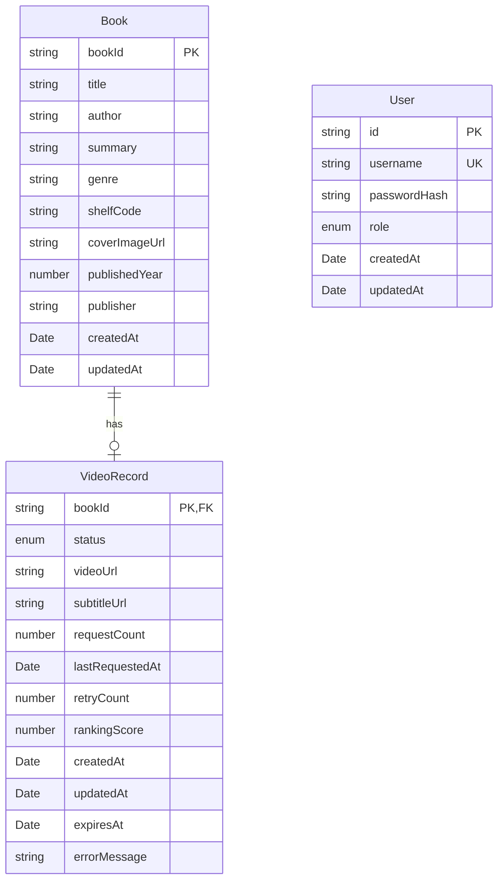

# Entity Relationship Diagram

## Database Schema

### Book

Represents a library book.

| Field | Type | Description | Constraints |
|-------|------|-------------|-------------|
| bookId | string | Primary key (ISBN or internal ID) | PK, NOT NULL |
| title | string | Book title | NOT NULL |
| author | string | Book author | NOT NULL |
| summary | string | Book summary/description | NOT NULL |
| genre | string | Book genre/category | NOT NULL |
| shelfCode | string | Physical shelf location | NOT NULL |
| coverImageUrl | string | URL to cover image | NULLABLE |
| publishedYear | number | Year of publication | NULLABLE |
| publisher | string | Publisher name | NULLABLE |
| createdAt | Date | Record creation timestamp | NOT NULL |
| updatedAt | Date | Record update timestamp | NULLABLE |

**Indexes:**
- Primary: `bookId`
- Index: `title` (for text search)
- Index: `author` (for author search)
- Index: `genre` (for filtering)

---

### VideoRecord

Represents video generation status and metadata for a book.

| Field | Type | Description | Constraints |
|-------|------|-------------|-------------|
| bookId | string | Foreign key to Book | PK, FK, NOT NULL |
| status | enum | Video status | NOT NULL |
| videoUrl | string | URL to generated video | NULLABLE |
| subtitleUrl | string | URL to subtitle file (.vtt) | NULLABLE |
| requestCount | number | Total number of requests | NOT NULL, DEFAULT 0 |
| lastRequestedAt | Date | Timestamp of last request | NULLABLE |
| retryCount | number | Number of generation retries | NOT NULL, DEFAULT 0 |
| rankingScore | number | Calculated ranking score | NOT NULL, DEFAULT 0 |
| createdAt | Date | Record creation timestamp | NOT NULL |
| updatedAt | Date | Record update timestamp | NOT NULL |
| expiresAt | Date | Video expiration date | NULLABLE |
| errorMessage | string | Error details if failed | NULLABLE |

**Enums:**
- `status`: NONE, QUEUED, GENERATING, READY, FAILED

**Indexes:**
- Primary: `bookId`
- Index: `status` (for filtering)
- Index: `rankingScore` (for sorting)
- Foreign Key: `bookId` → `Book.bookId`

**Relationships:**
- One-to-One with Book (one video per book)

---

### User

Represents admin users.

| Field | Type | Description | Constraints |
|-------|------|-------------|-------------|
| id | string | Primary key (UUID) | PK, NOT NULL |
| username | string | Username for login | UNIQUE, NOT NULL |
| passwordHash | string | Bcrypt hashed password | NOT NULL |
| role | enum | User role | NOT NULL |
| createdAt | Date | Account creation timestamp | NOT NULL |
| updatedAt | Date | Account update timestamp | NULLABLE |

**Enums:**
- `role`: admin

**Indexes:**
- Primary: `id`
- Unique: `username`

---

## Relationships

```
┌─────────────┐         ┌──────────────┐
│    Book     │         │ VideoRecord  │
│─────────────│         │──────────────│
│ bookId (PK) │◄───────│ bookId (PK,FK)│
│ title       │  1:1    │ status       │
│ author      │         │ videoUrl     │
│ summary     │         │ rankingScore │
│ genre       │         │ requestCount │
│ shelfCode   │         │ expiresAt    │
└─────────────┘         └──────────────┘

┌─────────────┐
│    User     │
│─────────────│
│ id (PK)     │
│ username    │
│ passwordHash│
│ role        │
└─────────────┘
```

## Visual ERD



## Calculated Fields

### rankingScore

Calculated using:

```javascript
rankingScore = requestCount + (recent7DayRequests × 1.5)
```

Where:
- `requestCount`: Total number of video requests
- `recent7DayRequests`: Requests in the last 7 days

This field is updated:
- When a video is requested (user or admin)
- When a video is marked as READY
- Periodically by a background job (recommended)

### expiresAt

Default calculation:

```javascript
expiresAt = createdAt + VIDEO_DEFAULT_EXPIRY_DAYS (90 days)
```

Can be manually adjusted by admin via API.

## Data Migration Notes

When migrating from in-memory to persistent database:

1. Add proper database constraints (PRIMARY KEY, FOREIGN KEY, UNIQUE, NOT NULL)
2. Add indexes for performance:
   - `Book(title)` for text search
   - `Book(genre)` for filtering
   - `VideoRecord(status)` for filtering
   - `VideoRecord(rankingScore)` for sorting
3. Consider partitioning `VideoRecord` by `createdAt` for scalability
4. Set up cascading deletes: When a Book is deleted, delete associated VideoRecord
5. Add database triggers for `updatedAt` auto-update
6. Implement soft deletes if needed (add `deletedAt` field)

## Sample Data

### Book Sample

```json
{
  "bookId": "ISBN-001",
  "title": "별을 헤아리는 아이",
  "author": "김동화",
  "summary": "밤하늘의 별을 세며 꿈을 키워가는 소년의 이야기입니다...",
  "genre": "과학동화",
  "shelfCode": "A-01-05",
  "createdAt": "2024-01-01T00:00:00.000Z"
}
```

### VideoRecord Sample

```json
{
  "bookId": "ISBN-001",
  "status": "READY",
  "videoUrl": "/videos/ISBN-001.mp4",
  "subtitleUrl": "/videos/ISBN-001.vtt",
  "requestCount": 15,
  "lastRequestedAt": "2024-01-15T10:30:00.000Z",
  "retryCount": 0,
  "rankingScore": 42.5,
  "createdAt": "2024-01-01T00:00:00.000Z",
  "updatedAt": "2024-01-15T10:30:00.000Z",
  "expiresAt": "2024-04-01T00:00:00.000Z"
}
```

### User Sample

```json
{
  "id": "550e8400-e29b-41d4-a716-446655440000",
  "username": "admin",
  "passwordHash": "$2b$10$...",
  "role": "admin",
  "createdAt": "2024-01-01T00:00:00.000Z"
}
```

## Future Enhancements

Potential schema additions:

1. **ViewHistory**: Track individual video views
   ```
   - userId (optional, for tracking)
   - bookId (FK)
   - viewedAt
   - duration (how long watched)
   ```

2. **BookCategory**: Many-to-many for multiple genres
   ```
   - bookId (FK)
   - categoryId (FK)
   ```

3. **UserFavorites**: Track user favorites
   ```
   - userId (FK)
   - bookId (FK)
   - favoritedAt
   ```

4. **VideoAnalytics**: Detailed analytics
   ```
   - videoId (FK)
   - metric (views, completion_rate, etc.)
   - value
   - timestamp
   ```

5. **AuditLog**: Track admin actions
   ```
   - userId (FK)
   - action (create, update, delete)
   - resource (book, video)
   - timestamp
   ```
