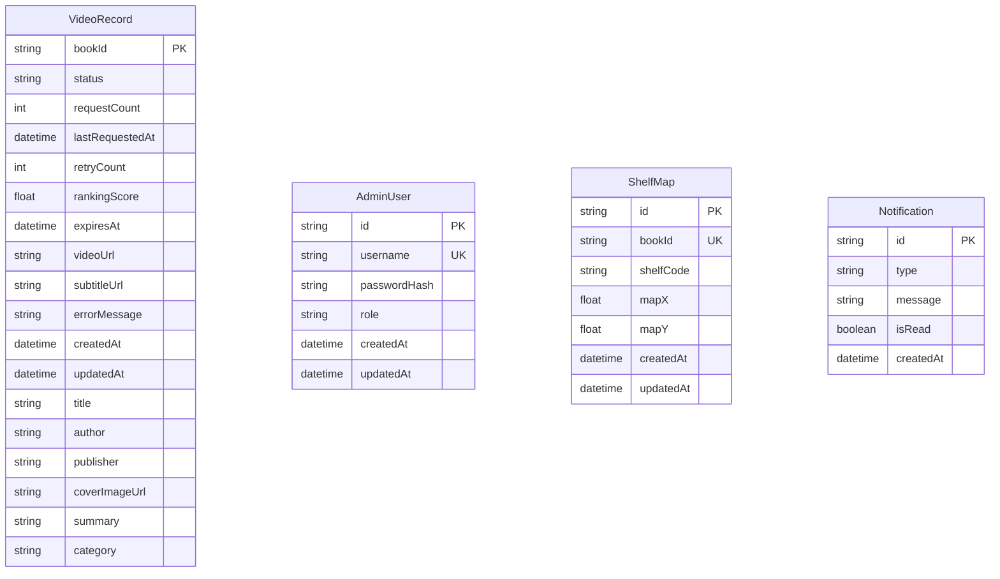

# Entity Relationship Diagram

> **마지막 업데이트**: 2026-02-28

## 데이터베이스 개요

- **DBMS**: SQLite (개발), PostgreSQL (운영 권장)
- **ORM**: Prisma
- **책 정보**: ALPAS API에서 실시간 조회 (별도 테이블 없음)

## 테이블 스키마

### VideoRecord

영상 생성 상태 및 메타데이터 (책 정보 캐시 포함)

| 필드 | 타입 | 설명 | 제약조건 |
|------|------|------|----------|
| bookId | String | 책 ID (ALPAS 기준) | PK |
| status | String | 영상 상태 | DEFAULT "NONE" |
| requestCount | Int | 요청 횟수 | DEFAULT 0 |
| lastRequestedAt | DateTime? | 마지막 요청 시간 | NULLABLE |
| retryCount | Int | 재시도 횟수 | DEFAULT 0 |
| rankingScore | Float | 랭킹 점수 | DEFAULT 0 |
| expiresAt | DateTime? | 만료 일시 | NULLABLE |
| videoUrl | String? | 영상 URL | NULLABLE |
| subtitleUrl | String? | 자막 URL (.vtt) | NULLABLE |
| errorMessage | String? | 오류 메시지 | NULLABLE |
| createdAt | DateTime | 생성 시간 | DEFAULT now() |
| updatedAt | DateTime | 수정 시간 | @updatedAt |
| title | String? | 책 제목 (캐시) | NULLABLE |
| author | String? | 저자 (캐시) | NULLABLE |
| publisher | String? | 출판사 (캐시) | NULLABLE |
| coverImageUrl | String? | 표지 URL (캐시) | NULLABLE |
| summary | String? | 요약 (캐시) | NULLABLE |
| category | String? | 카테고리 (캐시) | NULLABLE |

**Status 값:**
- `NONE`: 영상 없음
- `QUEUED`: 생성 대기 중
- `GENERATING`: 생성 중
- `READY`: 완료
- `FAILED`: 실패

---

### AdminUser

관리자 계정

| 필드 | 타입 | 설명 | 제약조건 |
|------|------|------|----------|
| id | String | UUID | PK |
| username | String | 사용자명 | UNIQUE |
| passwordHash | String | 암호화된 비밀번호 | |
| role | String | 역할 | DEFAULT "admin" |
| createdAt | DateTime | 생성 시간 | DEFAULT now() |
| updatedAt | DateTime | 수정 시간 | @updatedAt |

---

### ShelfMap

책 위치 정보 (서가 맵)

| 필드 | 타입 | 설명 | 제약조건 |
|------|------|------|----------|
| id | String | UUID | PK |
| bookId | String | 책 ID | UNIQUE |
| shelfCode | String | 서가 코드 | INDEX |
| mapX | Float | X 좌표 | |
| mapY | Float | Y 좌표 | |
| createdAt | DateTime | 생성 시간 | DEFAULT now() |
| updatedAt | DateTime | 수정 시간 | @updatedAt |

---

### Notification

시스템 알림

| 필드 | 타입 | 설명 | 제약조건 |
|------|------|------|----------|
| id | String | UUID | PK |
| type | String | 알림 유형 | |
| message | String | 알림 내용 | |
| isRead | Boolean | 읽음 여부 | DEFAULT false |
| createdAt | DateTime | 생성 시간 | DEFAULT now() |

---

## ERD 다이어그램



## 설계 특징

### 책 정보 캐싱

VideoRecord에 책 정보(title, author 등)를 캐싱하는 이유:
- ALPAS API 장애 시에도 기존 영상 정보 표시 가능
- 영상 생성 시점의 책 정보 보존
- API 호출 횟수 감소

### 랭킹 점수 계산

```javascript
rankingScore = requestCount + (recent7DayRequests × 1.5)
```

### 영상 만료 관리 (LRU Cache)

- 기본 만료: 90일
- 만료 기준: `expiresAt`, `lastRequestedAt`, `requestCount`
- 관리자가 수동 연장/삭제 가능

## Prisma 스키마

```prisma
generator client {
  provider = "prisma-client-js"
}

datasource db {
  provider = "sqlite"
  url      = env("DATABASE_URL")
}

model AdminUser {
  id           String   @id @default(uuid())
  username     String   @unique
  passwordHash String
  role         String   @default("admin")
  createdAt    DateTime @default(now())
  updatedAt    DateTime @updatedAt

  @@map("admin_users")
}

model VideoRecord {
  bookId          String    @id
  status          String    @default("NONE")
  requestCount    Int       @default(0)
  lastRequestedAt DateTime?
  retryCount      Int       @default(0)
  rankingScore    Float     @default(0)
  expiresAt       DateTime?
  videoUrl        String?
  subtitleUrl     String?
  errorMessage    String?
  createdAt       DateTime  @default(now())
  updatedAt       DateTime  @updatedAt
  
  title           String?
  author          String?
  publisher       String?
  coverImageUrl   String?
  summary         String?
  category        String?

  @@map("video_records")
}

model ShelfMap {
  id         String   @id @default(uuid())
  bookId     String   @unique
  shelfCode  String
  mapX       Float
  mapY       Float
  createdAt  DateTime @default(now())
  updatedAt  DateTime @updatedAt

  @@index([shelfCode])
  @@map("shelf_maps")
}

model Notification {
  id        String   @id @default(uuid())
  type      String
  message   String
  isRead    Boolean  @default(false)
  createdAt DateTime @default(now())

  @@map("notifications")
}
```

## 샘플 데이터

### VideoRecord

```json
{
  "bookId": "70007968",
  "status": "READY",
  "requestCount": 15,
  "lastRequestedAt": "2026-02-28T10:30:00.000Z",
  "retryCount": 0,
  "rankingScore": 42.5,
  "expiresAt": "2026-05-28T00:00:00.000Z",
  "videoUrl": "/api/videos/70007968-1772221734134.mp4",
  "subtitleUrl": "/api/videos/70007968-1772221734134.vtt",
  "title": "별을 헤아리는 아이",
  "author": "김동화",
  "publisher": "아이북스",
  "coverImageUrl": "https://alpas.example.com/covers/70007968.jpg",
  "summary": "밤하늘의 별을 세며 꿈을 키워가는 소년의 이야기",
  "category": "과학동화"
}
```

### AdminUser

```json
{
  "id": "550e8400-e29b-41d4-a716-446655440000",
  "username": "admin",
  "passwordHash": "$2b$10$...",
  "role": "admin"
}
```
